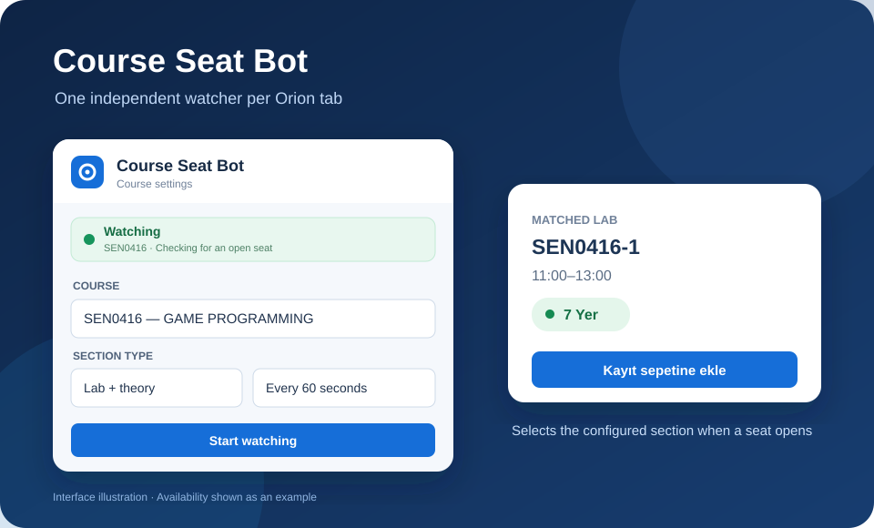

# İKÜ Course Seat Bot

This local Chrome extension can watch a different İKÜ Orion course in each Orion tab. You enter the course code and name, section type, optional times, an optional exact section code, and a refresh interval for each tab. It uses Chrome alarms and page controls, so routine checks do not call Codex or use AI tokens.

## Install

1. In Chrome, open `chrome://extensions`.
2. Turn on **Developer mode**.
3. Click **Load unpacked** and choose this `game-seat-bot` folder.
4. Open and sign in to the İKÜ Orion registration page in a Chrome tab. Leave that tab open.
5. While that tab is active, open the extension popup, review the settings, and click **Start watching**. To watch another course, open Orion in another Chrome tab and start that tab's watcher separately.

The popup is prefilled for `SEN0416` / `GAME PROGRAMMING`, section `SEN0416-1`, lab `11:00-13:00`, theory `09:00-11:00`, and 60 seconds. Choose **Lab + theory**, **Theory only**, or **Single section / online** for other courses. Times may be blank if the course and section code identify one row. If more than one row matches, the bot pauses for clarification rather than choosing one arbitrarily.

For an Orion section labeled `MCB1001 *1-2`, enter course code `MCB1001 *1` and section code `MCB1001 *1-2`. You can also paste `MCB1001 *1-2` into Course code with Section code blank; the form splits it automatically when saving or starting. Use the course name shown in Orion, such as `CALCULUS I`.

Each tab has its own course settings, refresh timer, status, test run, and Stop control. Switching tabs and opening the popup shows that tab's bot. Saved courses are shared across tabs; choosing one in a tab loads it there. The existing single-tab watcher is migrated automatically when the extension updates.

## Saved courses

- In the **Course** tab, enter a course and click **Save as new**. This stores its code, name, section type, section, optional times, and refresh interval in Chrome's local extension storage.
- Open **Saved courses**, choose a course from the dropdown, and click **Use this course**. Its settings load into the Course form, ready for **Start watching** or **Do a test run**.
- To edit a saved course, use it, change its fields in the Course tab, and click **Update saved**. Use **Save as new** to keep both versions.
- To delete a saved course, choose it in **Saved courses** and click **Delete**. Deleting a saved entry leaves the current form values and any running watcher alone.

## What it does

- Refreshes each watched Orion tab at its own chosen interval (30–3600 seconds). Chrome can delay alarms; the interval is not a precise timer.
- Finds the course and requires exactly one matching selection. Lab + theory mode also requires exactly one corresponding theory row. Blank times are accepted when the remaining settings identify the row uniquely.
- Acts only when the selected row shows a green positive availability such as **7 Yer**. It selects the configured row (and theory in Lab + theory mode), then invokes Orion's SAP **Kayıt sepetine ekle** button event once. It requires an acknowledgement from the page before reporting that the basket action was triggered.
- If capacity fills before the attempt completes, it keeps watching on the next refresh. On a confirmed success, it stops and sends a Chrome notification. If the result is unclear, it stops so it cannot submit again blindly.

This adds a course to the **registration basket**. Check Orion for any separate final enrollment step.

## Controls and limits

- Click **Stop** in the popup to stop the watcher in the current tab. Other tabs keep watching.
- Click **Do a test run** while the watcher is stopped to make one real basket attempt. It selects the configured row (and matching theory when applicable), clicks **Kayıt sepetine ekle**, and reports Orion's success or capacity-full response. If a seat is available, the course may be added to the basket. If no clear response appears, check the basket before trying again.
- Test results are read from Orion's SAP message area, including messages that do not appear in the page's visible text.
- If you already loaded an earlier version of this unpacked extension, click its **Reload** icon at `chrome://extensions`, then reopen the popup to get the latest controls.
- Keep Chrome running and each target tab open. Closing a tab removes that tab's bot; navigating it away from Orion pauses its watcher.
- If Orion changes its page layout or signs you out, the bot may pause and require a new Start.
- This extension has access only to `orion.iku.edu.tr`, plus Chrome's local storage, tabs, alarms, and notifications. It makes no requests to other services and stores no password.
